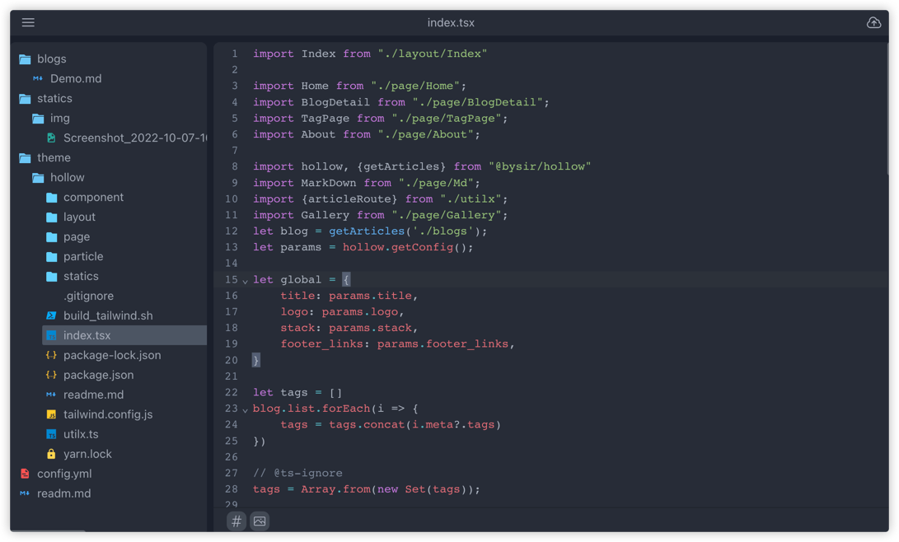

# hollow-ui
Web UI for [zbysir/hollow](https://github.com/zbysir/hollow)

hollow-ui 支持在服务器上运行一个 Web Editor，现在我们写 blog 不用再打开笨重的编辑器了，甚至可以在手机上进行。

## 特性

- 方便的上传图片等静态文件，支持上传到本地与 OSS（暂时仅支持七牛云）
- 可视化文件编辑器，管理逻辑和本地文件一致。
- 用来编辑 blog 源文件，提供富文本、markdown 编辑器。
